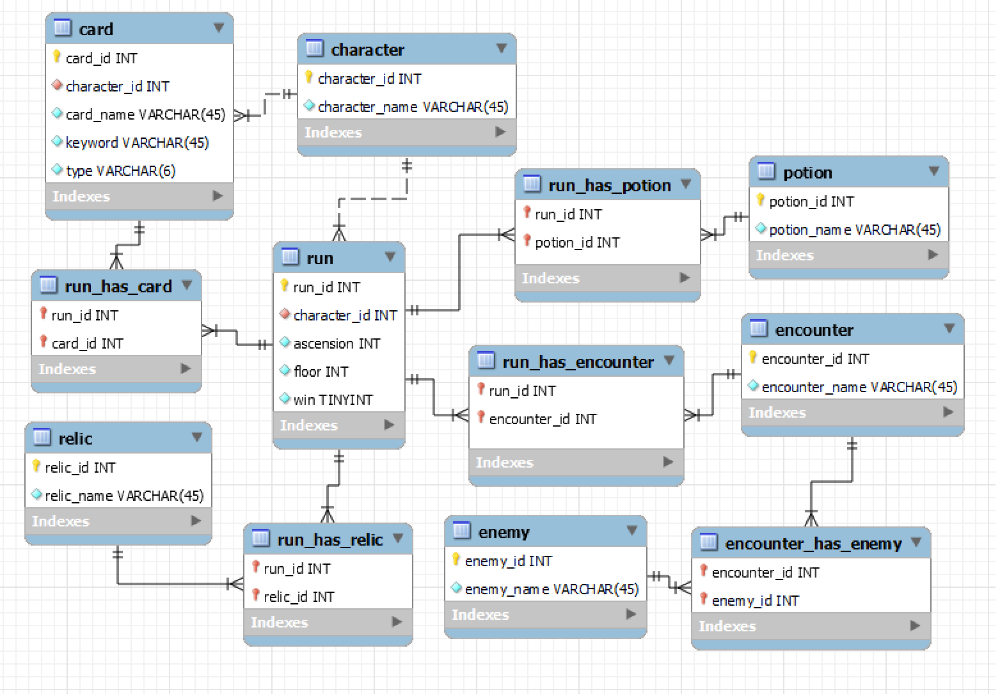

# Overview

This program is an attempt to better learn SQLite to potentially be used as a tool in game development. The purpose of this program is to take information from runs for a rougelite deckbuilding game called Slay the Spire and calculate the win rates for items and encounters in the game. This information would theoretically be used to make informed balancing decisions.

This program is a simple Python program run through the console. Console prompts give you the option to perform different actions in the database, which will then display results to the console.

[Software Demo Video](https://youtu.be/uKkzg3hBjQM)

<iframe width="560" height="315" src="https://www.youtube.com/embed/uKkzg3hBjQM" title="YouTube video player" frameborder="0" allow="accelerometer; autoplay; clipboard-write; encrypted-media; gyroscope; picture-in-picture" allowfullscreen></iframe>

# Relational Database

Database is formatted in SQLite

Database structure is based around indiviudal runs, with the main linking table tracking runs, and other tables containing information on game items that were used or encountered.

# Development Environment

Code was written in Visual Studio Code. Database ERD was created in MySQL Workbench 8.0. Database being used is SQLite.

Written with Python 3.10.7 using SQLite3 library and syntax for commands.

# Useful Websites

These are some useful sites that helped with SQLite specific syntax

* [Geeks For Geeks](https://www.geeksforgeeks.org/how-to-import-a-csv-file-into-a-sqlite-database-table-using-python/)
* [SQLite Tutorial (Insert Statement)](https://www.sqlitetutorial.net/sqlite-insert/)
* [Tutorials Point (AND OR Operators)](https://www.tutorialspoint.com/sqlite/sqlite_and_or_clauses.htm)
* [Tutorials Point (Artithmetic Operators)](https://www.tutorialspoint.com/sqlite/sqlite_arithmetic_operators.htm)
* [SQLite Official Documentation](https://www.sqlite.org/)

# Future Work

There are a few items that need to be improved or fixed and room for possible feature implementation.

* The method used to create the db file did not properly set auto-incrementation for the primary key and does not enforce the key. Likely will require remaking the entire database to ensure those work properly.
* A major issue with the current win rate calculation function is the fact it does not return a win rate, returning 0 and does not work for tables other than the relic table.
* Additional functionality - Slay The Spire has text files that are available to read in the game files that keep track of individual runs. Steps could be taken to parse those files to automatically populate the database with new run information without having to add it manually.
* UI improvements could be made to streamline the process and reduce the risk of user input error.